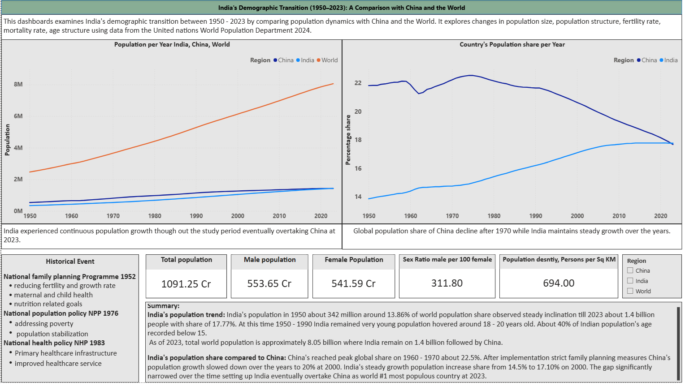
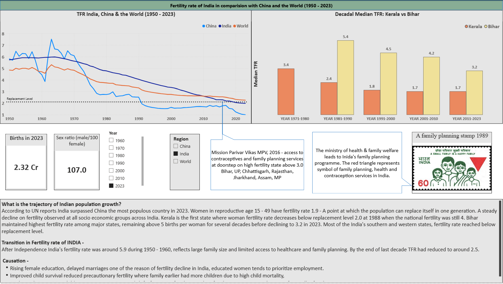
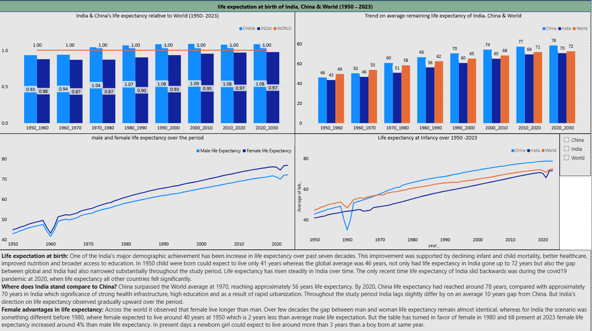
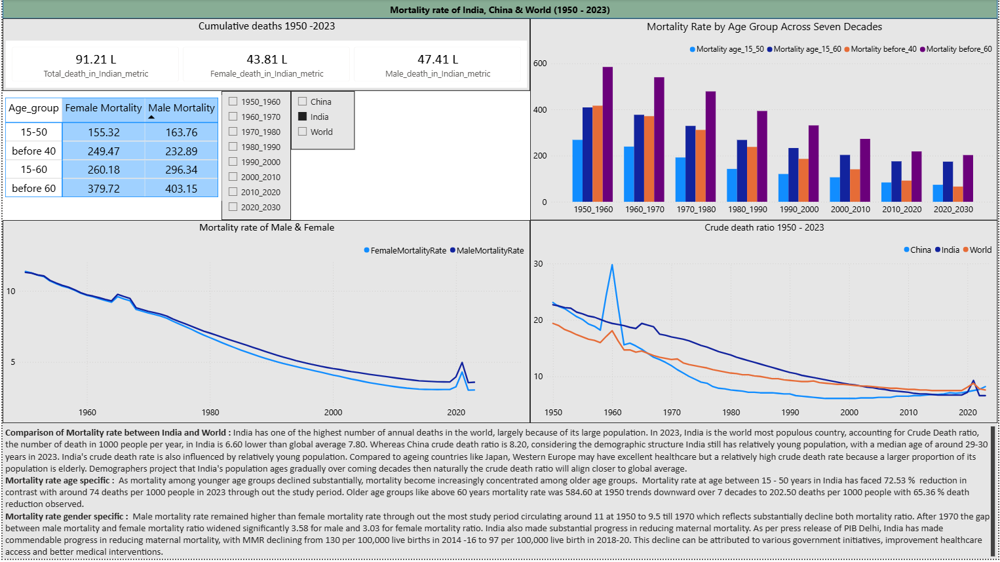

# India's Demographic Transition
## Analytical dashboards:
### United Nations demographic transition data 19505-2023

> `PROJECT TITLE: India vs World: Demographic Transition Analysis 1950 - 2023`

### Objective:
>
> - Analyze India's population growth over time.
> - Compare India's demographic with China and World Demographic change.
> - Examine fertility rate, mortality rate, life expectancy, migration data
> - Identify mejor demographic transition
> - examine governmental policies implications and effects on demographic change
> - Use SQL and python for data extraction, transformation and analysis
> - Use PowerBI and Dax expressions for Visualizations and interactive dashboards. 

### Technical Stack:
> - Python
> - Pandas
> - PostgreSQL
> - PowerBI
> - Jupyter Notebook
> - Git & Github

# Key analytical Questions:
> -  How has India's population changed relative to world?
> -  How has India's population growth rate evolved?
> -  How has India's fertility rate changed over time?
> -  How has life expectancy changed?
> -  what are the policy implications done by governments for addressing mortality rate, fertility rate and life expectancy?
> -  How does India's demographic trajectory differs from global trajectory?
---
Dashboard
>

### Key findings:
> - India's Population growth has undergone substantial growth over the historical period analyzed.
> - Fertility has declined significantly over time below replacement level 2.1.
> - Life expectancy has increased substantially.
> - India's demographic structure is transitioning toward an older population median age 29.
> - India's demographic trajectory differs from the global average trajectory in several indicators. 

### SQL analysis:
> - Designed the demographic dataset into postgreSQL
> - created a structured table
> - queried demographic indicators
> - filtered India, China and global observations
> - Calculated/ aggregated relevant metrics
> - extracted analytical datasets for further visualization

> `SQL\Query\data_query.sql`

> `Problem → Data → Method → SQL → Analysis → Visualization → Finding`
